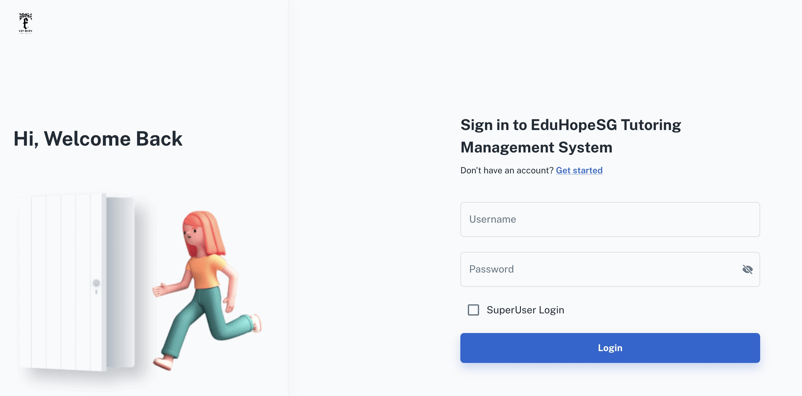

# About Tutoring Management System
The TMS is an open-source software that enables volunteer managers to visualize their active tutors. It is live at [https://eduhopesg.onrender.com](https://eduhopesg.onrender.com).

## Homepage
The homepage requires the volunteer manager to log in before viewing the list of active tutors.



## Dashboard
On logging in, volunteer managers can view the list of tutor-tutee pairings, including the corresponding subjects and levels. It also tracks the number of days since they last held their tutoring session, allowing the volunteer manager to prioritize less active pairings.


## Tutor info
The user can also view more information on the tutee, such as their perceived strengths and weaknesses. This helps volunteer managers better understand the beneficiaries they serve.


## Running TMS locally
### Frontend
After cloning the repository, make a local .env copy using .env.example.

For REACT_APP_URL, set it to "http://localhost:{PORT}". The REACT_APP_SEARCH_TOKEN refers to the JWT token with privileged access to search the database.

Afterwards, to host the frontend locally, run
```bash
npm install
npm start
```

### Backend
Make a local .env copy using .env.example.

For DATABASE_URL, insert the url of the database your backend is attached to. REVOKED_TOKEN1 can be left empty.

To host it locally, run
```bash
npm install
npm run dev
```

To implement a database schema update in Sequelize, run "npm run migration:up" and to rollback, run "npm run migration:down".

Note: The live build is currently linked to a ElephantSQL database, which has unfortunately terminated its service.
